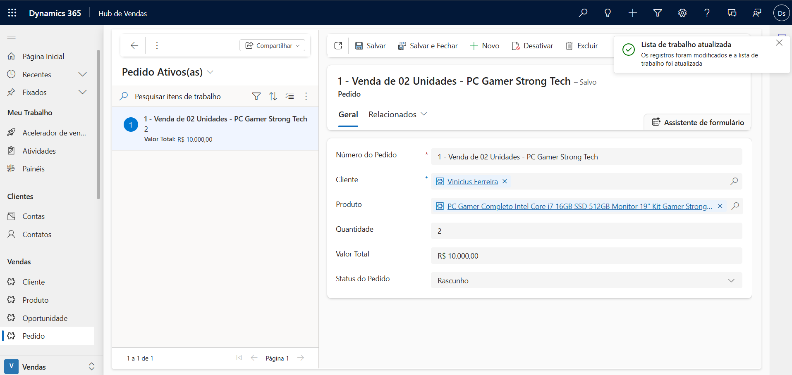
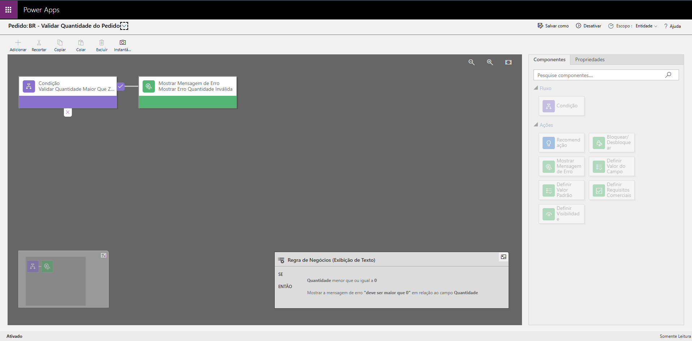
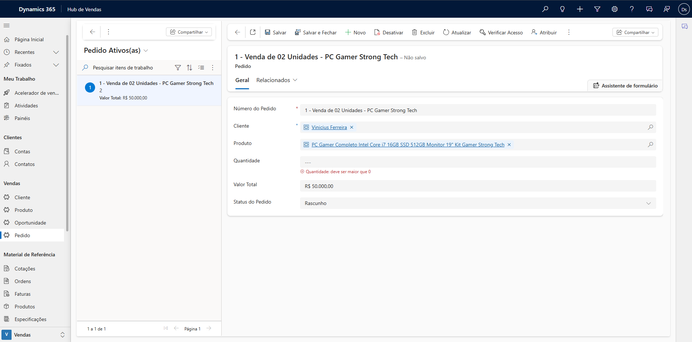
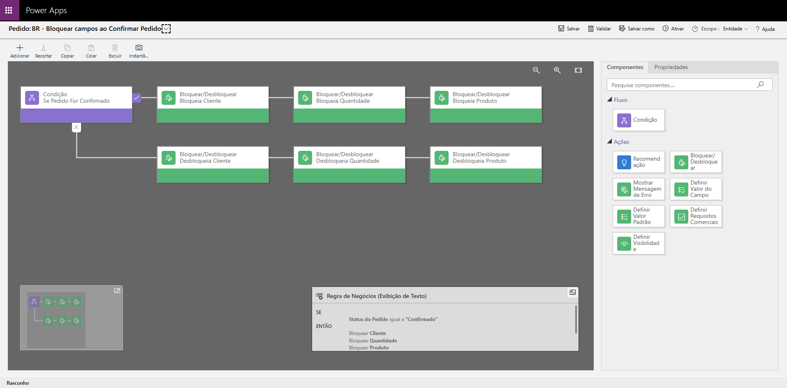
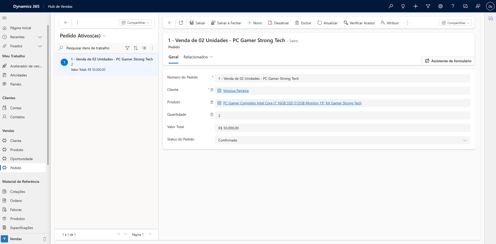
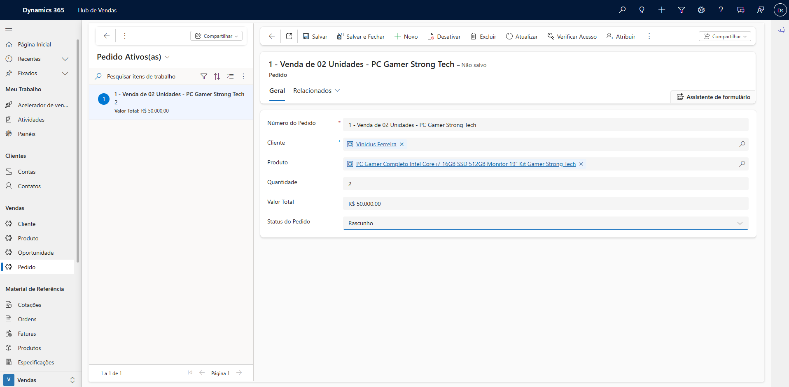
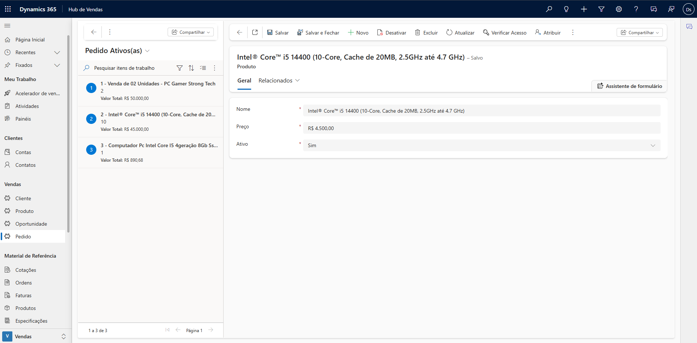
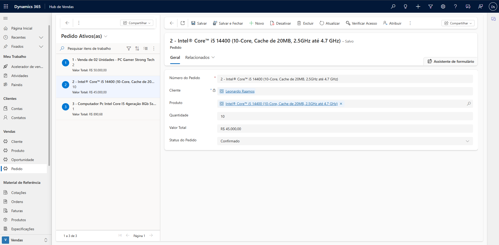

# Sales Lab – Dynamics 365 CRM

Projeto de CRM de vendas desenvolvido no Microsoft Dynamics 365, utilizando Dataverse e Model-Driven App.
O objetivo do projeto é simular um cenário real de gestão de clientes, produtos e pedidos, aplicando boas práticas
de modelagem de dados e estruturação de aplicações no Dynamics 365.

---

## 🎯 Objetivo do Projeto

Criar um sistema de CRM funcional para controle de vendas, permitindo:
- Cadastro de clientes
- Cadastro de produtos
- Criação e gerenciamento de pedidos
- Relacionamento entre dados de forma estruturada
- Validação de regras de negócio

Este projeto está sendo desenvolvido com foco em aprendizado prático e construção de portfólio
para vagas de estágio e nível júnior em Dynamics 365.

---

## 🧱 Modelagem de Dados (Dataverse)

### Tabela Cliente
Responsável por armazenar as informações dos clientes.

Campos principais:
- Nome
- Email
- Telefone

---

### Tabela Produto
Armazena os produtos disponíveis para venda.

Campos principais:
- Nome do Produto
- Preço
- Status

.png)

---

### Tabela Pedido
Representa os pedidos realizados pelos clientes.

Campos principais:
- Cliente
- Produto
- Quantidade
- Valor Total
- Status do Pedido

---

## 🔗 Relacionamentos

- **Cliente (1:N) Pedido**  
  Um cliente pode possuir vários pedidos.

- **Produto (1:N) Pedido**  
  Um produto pode estar associado a vários pedidos.

---

## 🧩 Model-Driven App

Foi criado um Model-Driven App baseado nas tabelas do Dataverse, permitindo
a navegação e o gerenciamento dos dados de forma padrão do Dynamics 365.

Funcionalidades disponíveis:
- Cadastro e edição de Clientes
- Cadastro e edição de Produtos
- Criação e acompanhamento de Pedidos

---

## ⚙️ Business Rules

Foram implementadas regras de negócio para validação e controle dos dados diretamente no formulário do Pedido.

---

### ✔️ Regra 1 – Validação da Quantidade do Pedido

Garante que a quantidade informada seja maior que zero.

Se a quantidade for menor ou igual a zero:
- O sistema exibe mensagem de erro
- O salvamento do registro é impedido

📷 Estrutura da regra:

📷 Funcionamento no formulário:

---

### ✔️ Regra 2 – Bloqueio de Campos ao Confirmar Pedido

Quando o status do pedido é alterado para **Confirmado**:

- Cliente, Produto e Quantidade são bloqueados para edição
- Caso o pedido volte para Rascunho, os campos são liberados novamente

📷 Estrutura da regra:

📷 Funcionamento com Pedido Confirmado:

📷 Funcionamento com Pedido em Rascunho:

---

## 💻 JavaScript (Formulário de Pedido)

Foi implementado um módulo JavaScript personalizado para melhorar a experiência do usuário
e adicionar lógica dinâmica ao formulário de Pedido.

### 🎯 Objetivos da implementação

- Calcular automaticamente o **Valor Total** (Preço × Quantidade)
- Utilizar Web API para buscar o preço do produto
- Manipular campos dinamicamente via `formContext`
- Garantir melhor usabilidade no preenchimento do Pedido

---

### ⚙️ Lógica Implementada

O script é executado nos eventos:

- `OnChange` do campo Produto
- `OnChange` do campo Quantidade

Fluxo da lógica:

1. Quando Produto e Quantidade são preenchidos
2. O sistema consulta o Preço do Produto via `Xrm.WebApi.retrieveRecord`
3. O Valor Total é calculado automaticamente
4. O campo Valor Total é atualizado no formulário

---

### 📷 Demonstração

#### Preço configurado no Produto

---

#### Cálculo automático no Pedido

---

### 🧠 Conceitos Utilizados

- `formContext`
- `getAttribute()` e `setValue()`
- `setSubmitMode("always")`
- `Xrm.WebApi.retrieveRecord`
- Manipulação de Lookup
- JavaScript modular (namespace pattern)

---

## ⚙️ Tecnologias Utilizadas

- Microsoft Dynamics 365
- Power Apps
- Dataverse
- Model-Driven App
- Business Rules
- JavaScript (Client-side customization)

---

## 📌 Status do Projeto

✔️ Modelagem de dados concluída  
✔️ Relacionamentos configurados  
✔️ Model-Driven App funcional  
✔️ Business Rules implementadas

✔️ JavaScript implementado (cálculo automático do pedido)

🔄 Próximos passos:
- Desenvolvimento de Plugin
- Automações com Power Automate
- Configuração de Security Roles

---

## 👤 Autor

Projeto desenvolvido por **Vinicius Ferreira** com foco em aprendizado prático
e desenvolvimento profissional na área de Dynamics 365.
